# School Management System (LSMS)

A full-featured school management system built with Laravel 8, designed for educational institutions such as schools and colleges. It supports role-based access control with seven distinct user types, comprehensive academic management, finance tracking, library management, and PDF report generation.

---

## Screenshots

| Dashboard | Login | My Account |
|-----------|-------|------------|
| 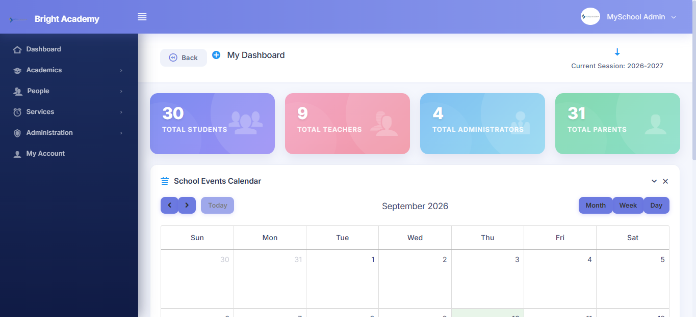 | 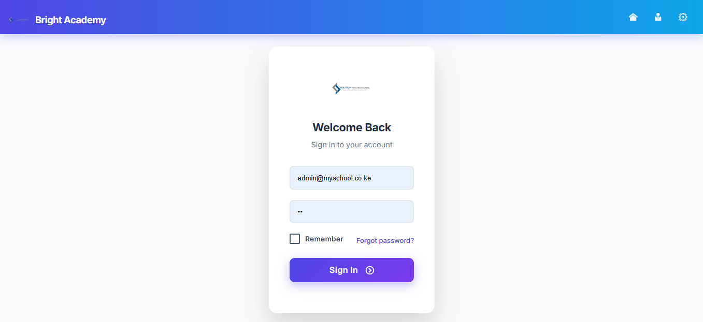 | 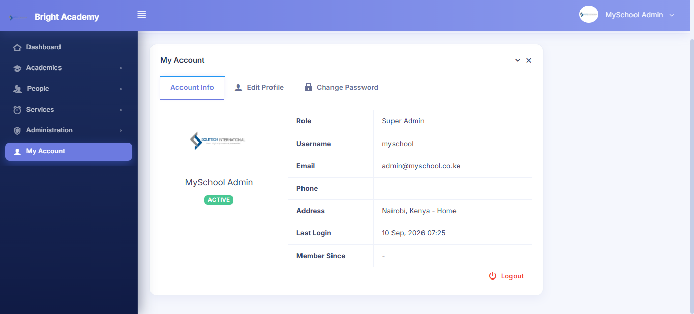 |

| Academic Dashboard | Administration Dashboard | Exam Dashboard |
|--------------------|--------------------------|----------------|
| 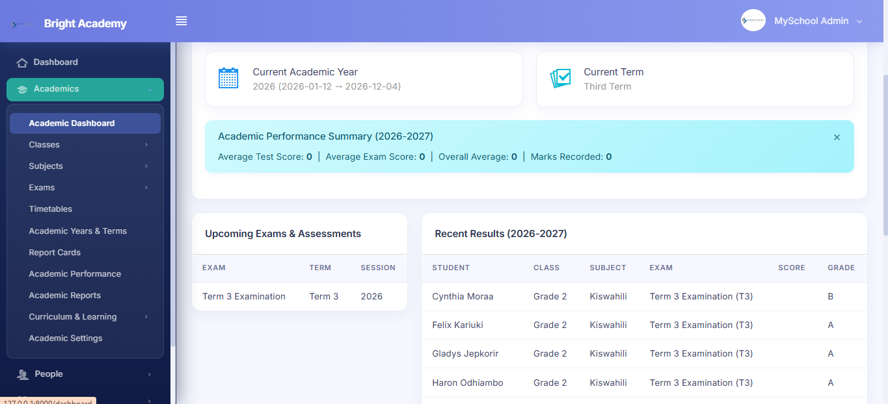 | 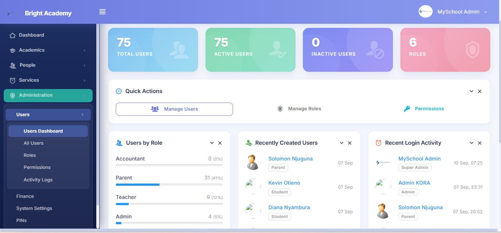 |  |

| All Students | Student Profile | Student Attendance |
|--------------|-----------------|---------------------|
| 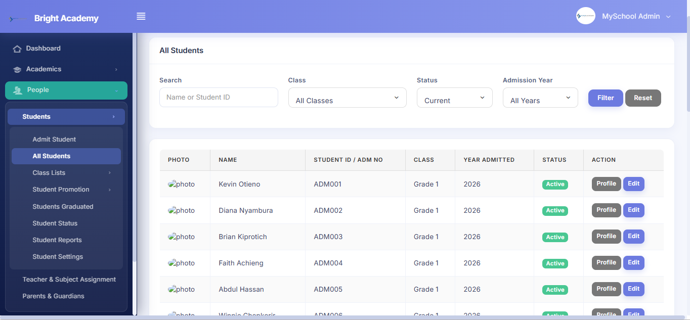 | 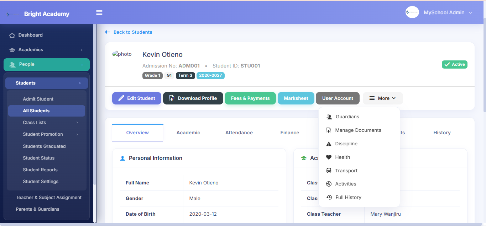 | 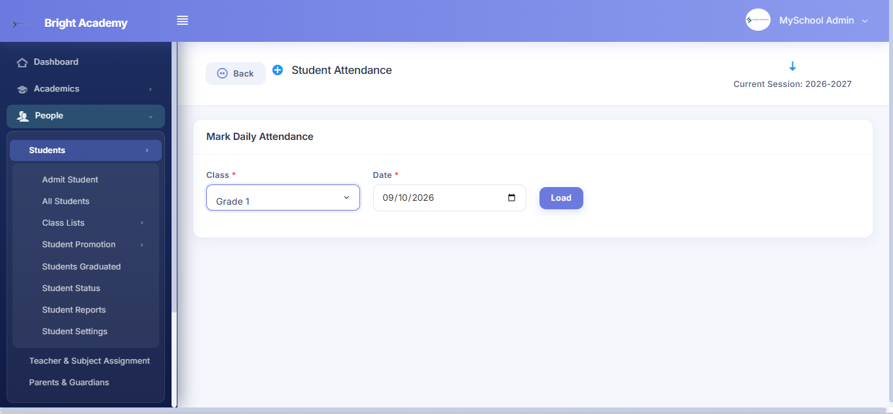 |

| Classes and Grades | Manage Subjects | Subjects Dashboard |
|--------------------|-----------------|---------------------|
| 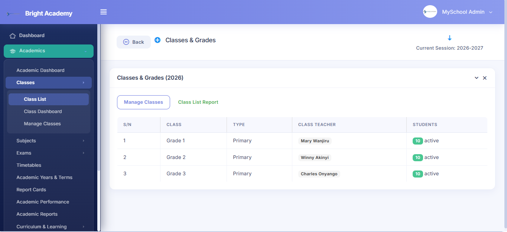 | 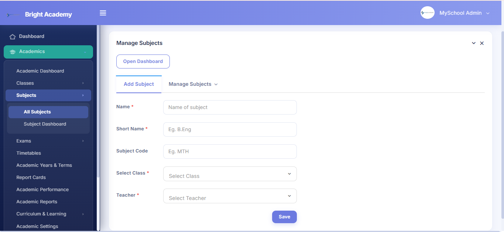 |  |

| Teacher and Subject Assignment | Finance | Academic Years and Terms |
|--------------------------------|---------|--------------------------|
| 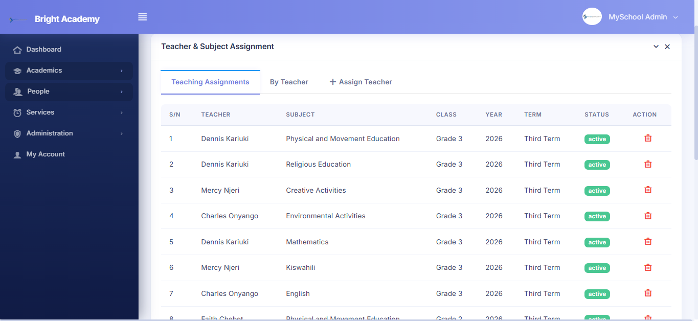 | 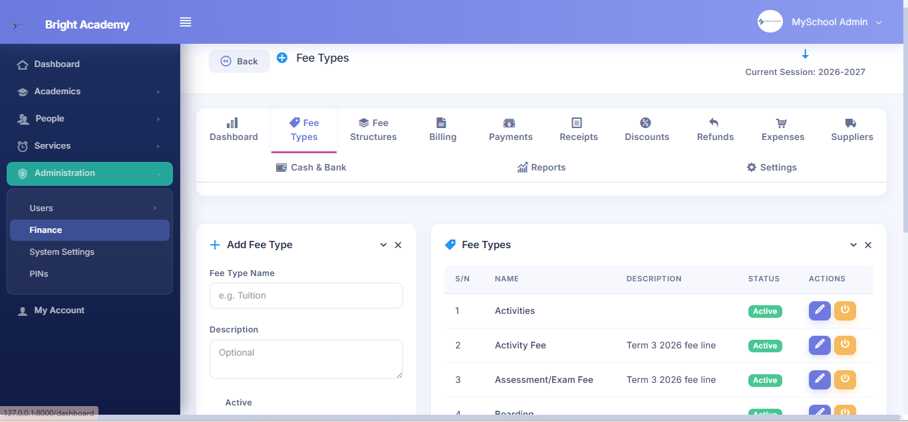 | 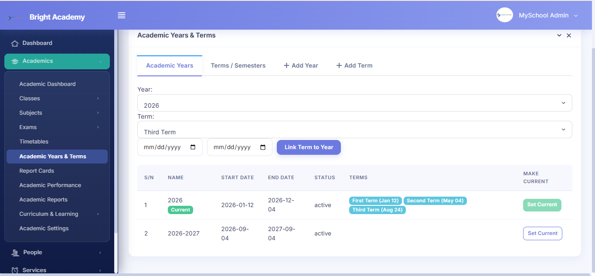 |

---

## Features

### User Roles

| Role | Capabilities |
|------|-------------|
| **Super Admin** | Full system access, delete any record, create any user account |
| **Admin** | Manage students, classes, exams, subjects, users, payments, noticeboard, system settings |
| **Teacher** | Manage own class/section, exam records, timetable, study materials, profile |
| **Student** | View marks, timetable, payments, library, noticeboard, calendar, profile |
| **Parent** | View child's marksheet (download/print PDF), timetable, payments, noticeboard, calendar |
| **Accountant** | Manage payments & fees, print payment receipts |
| **Librarian** | Manage library books |

### Academic Management

- Academic years & terms with current term tracking
- Class & section management with teacher assignment
- Subject management with curriculum & topic support
- Teacher-to-subject & teacher-to-class assignment
- Lesson planning & homework/assignment management with submissions & grading
- Student promotion between classes
- Student attendance tracking
- Marks entry, tabulation sheets, and batch updates
- Report cards with PDF generation
- Academic performance analytics by class, subject, and student

### Finance Module

- Fee types & fee structures per class
- Student billing & invoice generation
- Payment recording with receipt generation (PDF)
- Student fee statements (PDF)
- Discounts & refunds management
- Expense tracking with categories & suppliers
- Cash & bank account management
- Financial reports & dashboard
- **M-Pesa (Daraja) mobile payments** — STK push from the Payments page, status tracking, and automatic payment finalization via Safaricom callback

### Advanced Analytics

- Dedicated Analytics dashboard (ECharts) accessible to admins, teachers & accountants
- KPI cards: collected, grand total billed, outstanding, net
- Monthly income/expense cash-flow chart
- Payment method distribution (pie)
- Outstanding & student enrolment by class (bar)
- Exam performance & marks distribution by latest exam

### In-App Notifications

- Bell dropdown in the header with live unread badge
- Notification center page (mark read / mark all as read / delete)
- Automatic notifications: payment received (student + parent), results published (exam), new assignment (class students)

### Student Information

- Student registration with admission number & unique ID
- Student documents management (upload & download)
- Discipline, health, transport, and activity records
- Student status management (active/inactive/graduated)
- Guardian linking & management
- Student promotion & graduation tracking

### Other Features

- Time table management with reusable time slots
- Library book management & book request system
- Noticeboard & event calendar on dashboard
- PIN-based mark verification
- Role-based permissions system
- Activity logging & audit trail
- System settings (school name, session, currency, logo, etc.)

---

## Tech Stack

| Layer | Technology |
|-------|-----------|
| Backend | Laravel 8 (PHP ^7.2 \| ^8.0) |
| Frontend | Bootstrap 4, Vue.js 2, jQuery |
| Database | MySQL |
| PDF Generation | barryvdh/laravel-dompdf |
| Asset Compilation | Laravel Mix (Webpack) |
| Hashing | hashids/hashids |
| Auth | Laravel UI (Bootstrap scaffolding) |

---

## Requirements

- PHP >= 7.2 or >= 8.0
- MySQL >= 5.7
- Composer
- Node.js & NPM
- XAMPP / Laravel Homestead / Valet (or any PHP server environment)

See the full [Laravel 8 server requirements](https://laravel.com/docs/8.x/installation#server-requirements).

---

## Installation

1. **Clone the repository**

```bash
git clone <repository-url>
cd "School Management System"
```

2. **Install PHP dependencies**

```bash
composer install
```

3. **Install frontend dependencies**

```bash
npm install
```

4. **Create environment file**

```bash
cp .env.example .env
```

5. **Configure `.env`** with your database credentials and app settings:

```env
APP_NAME="School Management System"
APP_URL=http://localhost:8000

DB_CONNECTION=mysql
DB_HOST=127.0.0.1
DB_PORT=3306
DB_DATABASE=school_db
DB_USERNAME=root
DB_PASSWORD=
```

6. **Generate application key**

```bash
php artisan key:generate
```

7. **Run database migrations**

```bash
php artisan migrate
```

8. **Seed the database** (creates default users and sample data)

```bash
php artisan db:seed
```

9. **Compile frontend assets**

```bash
npm run dev
```

10. **Start the development server**

```bash
php artisan serve
```

Visit `http://localhost:8000` in your browser.

---

## Default Login Credentials

After seeding, use any of the following accounts to log in:

| Account Type | Username | Email | Password |
|-------------|----------|-------|----------|
| Super Admin | `cj` | `cj@cj.com` | `cj` |
| Admin | `admin` | `admin@admin.com` | `cj` |
| Teacher | `teacher` | `teacher@teacher.com` | `cj` |
| Student | `student` | `student@student.com` | `cj` |
| Parent | `parent` | `parent@parent.com` | `cj` |
| Accountant | `accountant` | `accountant@accountant.com` | `cj` |
| Librarian | `librarian` | `librarian@librarian.com` | `cj` |

> **Important:** Change these default credentials before deploying to production.

---

## Configuring M-Pesa (Daraja)

1. Register an app at the [Safaricom Daraja Portal](https://developer.safaricom.co.ke) to get your **Consumer Key**, **Consumer Secret**, and **Passkey**.
2. In the app, go to **Finance → Settings → M-Pesa (Daraja) Settings** and enter:
   - `Environment` — `sandbox` for testing (use test credentials) or `live`
   - `Shortcode / Paybill`, `Consumer Key`, `Consumer Secret`, `Passkey`
   - `Callback URL` — must be publicly reachable (e.g. `https://your-domain.com/finance/mpesa/callback`). Use a tool like ngrok while testing locally.
   - `Account Reference` (max 12 characters)
3. Save, then open **Finance → Payments** and click **Pay via M-Pesa** to send an STK push to the payer's phone.
4. Track requests under the **M-Pesa** tab (Finance → M-Pesa Transactions); successful callbacks automatically create the payment, update the student fee, and generate a receipt.

> Live paybills require your callback URL to be registered with Safaricom before going live.

---

## Project Structure

```
app/
├── Http/
│   ├── Controllers/
│   │   ├── SupportTeam/        # Controllers for admin/teacher/shared roles
│   │   ├── SuperAdmin/         # System settings controller
│   │   └── MyParent/           # Parent-specific controller
│   └── Middleware/              # Custom role-based middleware
├── Models/                     # Eloquent models (53 models)
├── Repositories/               # Repository pattern layer
└── Helpers/                    # Utility helpers

database/
├── migrations/                 # 50 migration files
└── seeders/                    # Database seeders

resources/
├── views/                      # Blade templates
└── js/                         # Vue components & JS

routes/
└── web.php                     # All web routes
```

---

## Testing

```bash
php artisan test
```

Or with PHPUnit directly:

```bash
./vendor/bin/phpunit
```

---

## Security Vulnerabilities

If you discover a security vulnerability, please report it responsibly. Do not open public GitHub issues for security-related concerns.

---
